<div align="center">

<br/>

<td></td>

### A simple, self-hosted Git registry — your code, your server, your rules.

<br/>

[](https://openjdk.org/)
[](https://spring.io/projects/spring-boot)
[](https://angular.dev)
[](https://tailwindcss.com/)
[](https://www.postgresql.org/)
[](https://www.docker.com/)
[](LICENSE)

<br/>

[Features](#-features) · [Tech Stack](#-tech-stack) · [Getting Started](#-getting-started) · [Screenshots](#-screenshots) · [Roadmap](#-roadmap) · [License](#-license)

<br/>

</div>

---

## What is OriginHub?

OriginHub is a simple, open-source, self-hosted Git registry inspired by GitHub. It gives you full control over your
repositories, pull requests, and CI/CD pipelines — running entirely on your own infrastructure, with zero dependency on
third-party platforms.

No subscriptions. No data leaving your servers. No vendor lock-in. Just Git, hosted your way.

OriginHub is built for developers and teams who care about ownership — whether you're an indie developer running it on a
VPS, or an enterprise team deploying it on private infrastructure. If you've ever thought *"I wish GitHub ran on my own
server"*, OriginHub is for you.

---

## ✨ Features

### 📁 Repository Management

- Create, clone, push, and pull repositories
- Private-only repositories for maximum control
- Topics and repository metadata
- Git protocol over **SSH** (port `2222`)

### 🗂 Code Browsing

- File tree navigation with breadcrumb trail
- Syntax-highlighted code viewer
- Markdown README rendering
- Raw file access
- Commit history with diff viewer

### 🔀 Pull Requests

- Open, review, and merge pull requests
- Three merge strategies: **Merge Commit**, **Squash**, **Rebase**
- Inline and file-level code comments
- Draft pull requests
- Conversation timeline

### ⚡ Actions — CI/CD *(coming soon)*

- YAML-based workflow definitions
- Job and step execution with real-time log streaming (SSE)
- Workflow run history with status filtering
- Trigger on push, pull request, or manual dispatch

### 🔐 Authentication

- Username + password with JWT
- OAuth2 via **Google**, **GitHub**, and **GitLab**
- SSH key-based authentication

### 👥 Team Collaboration *(coming soon)*

- Repository collaborators with permission levels (`READ`, `WRITE`, `ADMIN`)
- User profiles with activity feeds
- Explore page to discover repositories

---

## 🛠 Tech Stack

| Layer      | Technology                                      |
|------------|-------------------------------------------------|
| Language   | Java 25                                         |
| Framework  | Spring Boot 4, Spring Security, Spring Data JPA |
| Git Engine | Eclipse JGit                                    |
| SSH Server | Apache MINA SSHD                                |
| Auth       | JWT, OAuth2 (Google · GitHub · GitLab)          |
| Database   | PostgreSQL, Flyway                              |
| Frontend   | Angular 21, TypeScript 5                        |
| Styling    | Tailwind CSS 4, DaisyUI 5                       |
| Container  | Docker (multi-stage build, single image)        |

---

## 📸 Screenshots

<table>
  <tr>
    <td align="center"><b>Landing</b></td>
    <td align="center"><b>Dashboard</b></td>
  </tr>
  <tr>
    <td>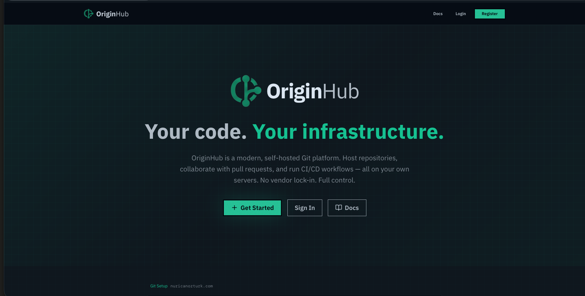</td>
    <td>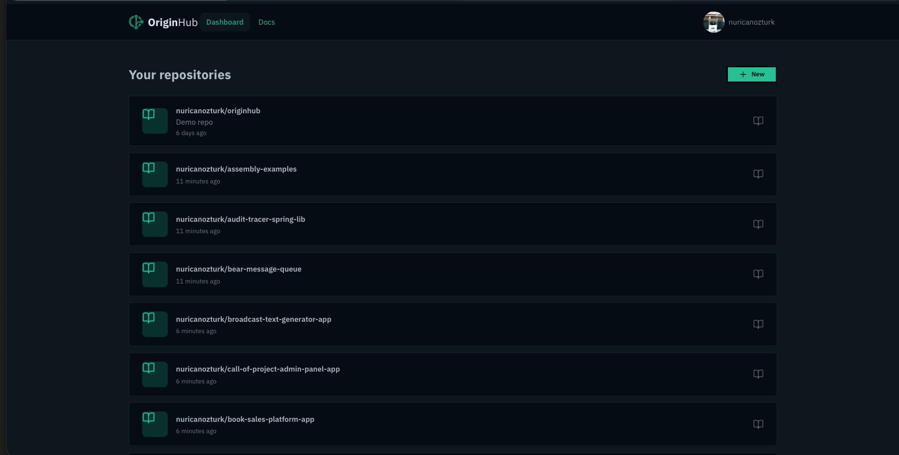</td>
  </tr>
  <tr>
    <td align="center"><b>Login</b></td>
    <td align="center"><b>Register</b></td>
  </tr>
  <tr>
    <td>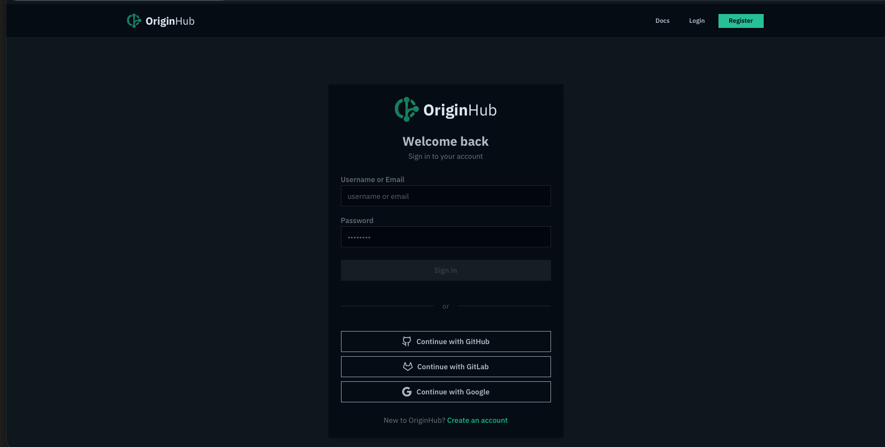</td>
    <td>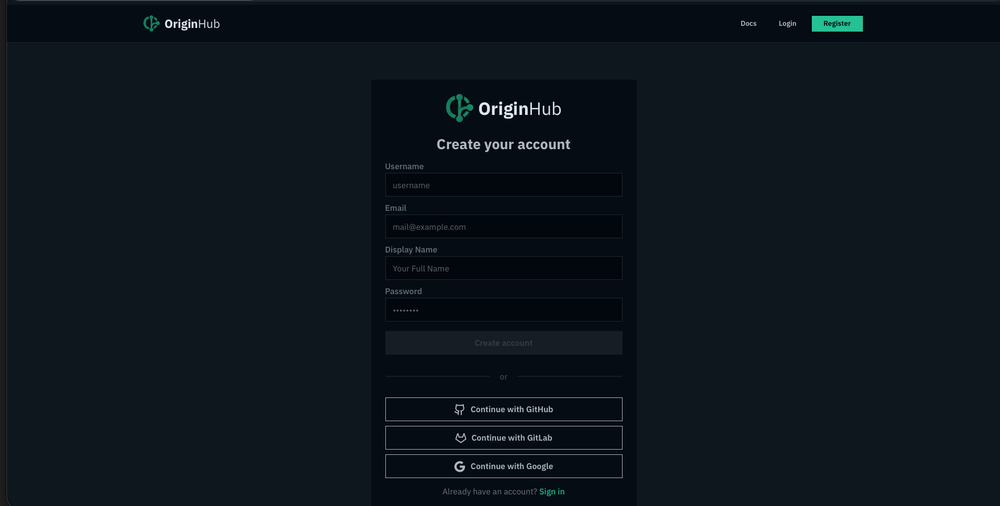</td>
  </tr>
  <tr>
    <td align="center"><b>Repository</b></td>
    <td align="center"><b>Repository (cont.)</b></td>
  </tr>
  <tr>
    <td>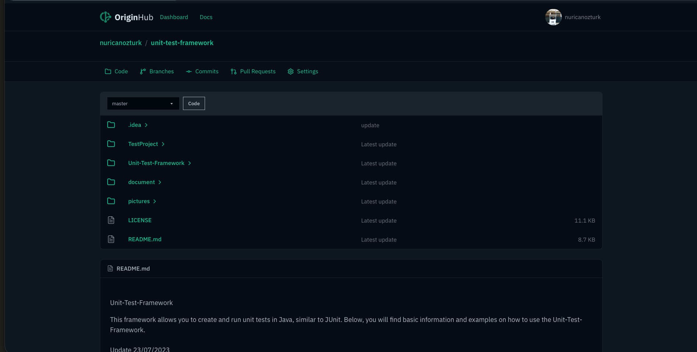</td>
    <td>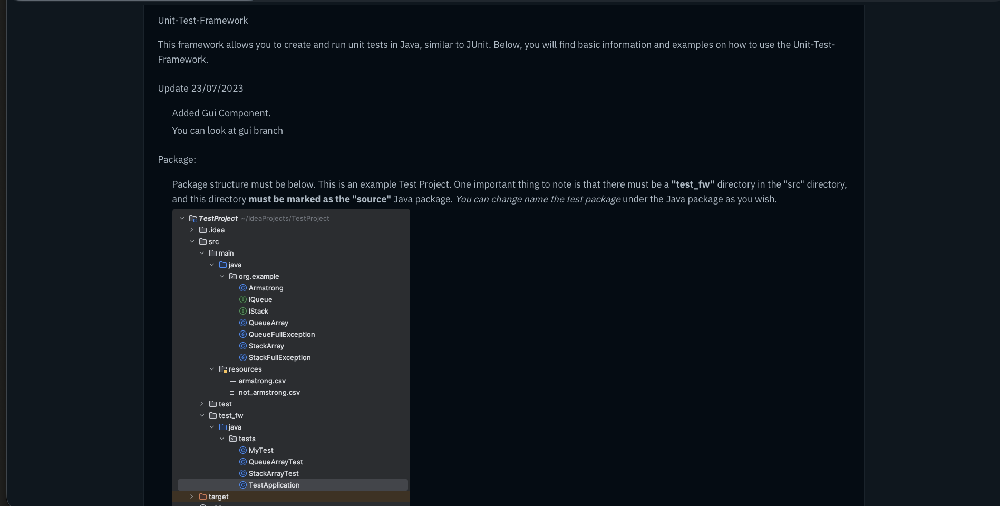</td>
  </tr>
  <tr>
    <td align="center"><b>Commits</b></td>
    <td align="center"><b>Commit Diffs</b></td>
  </tr>
  <tr>
    <td>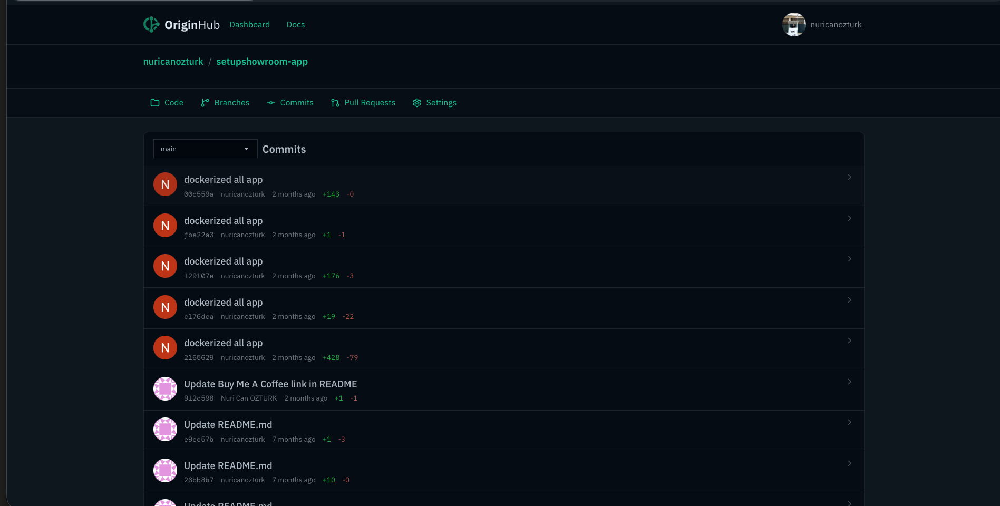</td>
    <td>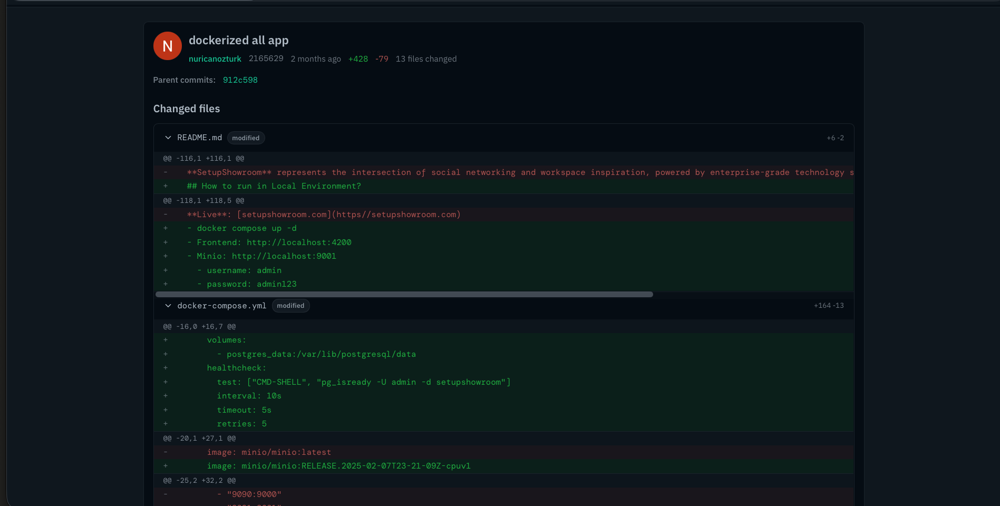</td>
  </tr>
  <tr>
    <td align="center"><b>Branches</b></td>
    <td align="center"><b>Pull Requests</b></td>
  </tr>
  <tr>
    <td>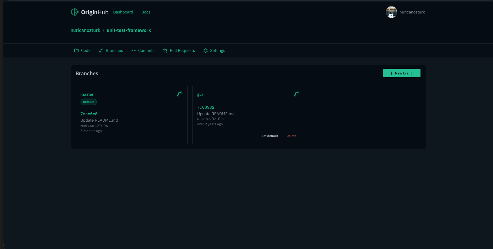</td>
    <td>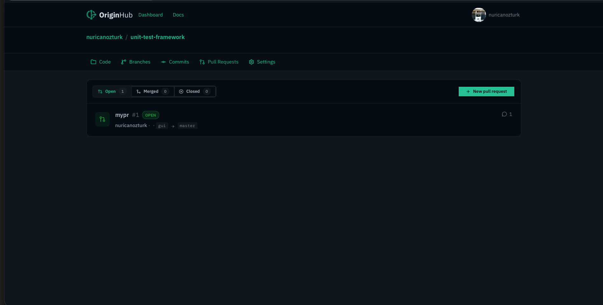</td>
  </tr>
  <tr>
    <td align="center"><b>PR Detail</b></td>
    <td align="center"><b>PR Detail (Files Changed)</b></td>
  </tr>
  <tr>
    <td>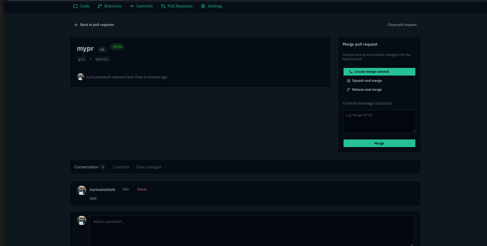</td>
    <td>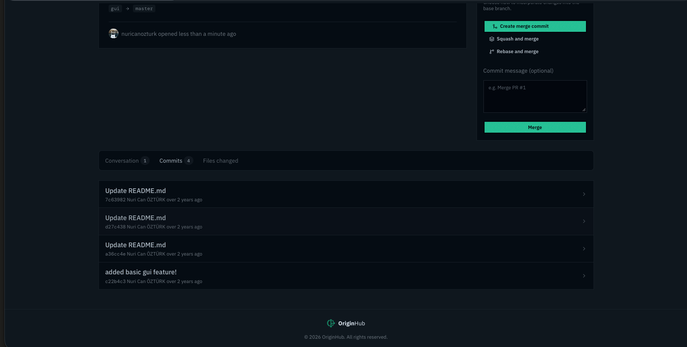</td>
  </tr>
  <tr>
    <td align="center"><b>PR Detail (Commits)</b></td>
    <td align="center"><b>Profile</b></td>
  </tr>
  <tr>
    <td>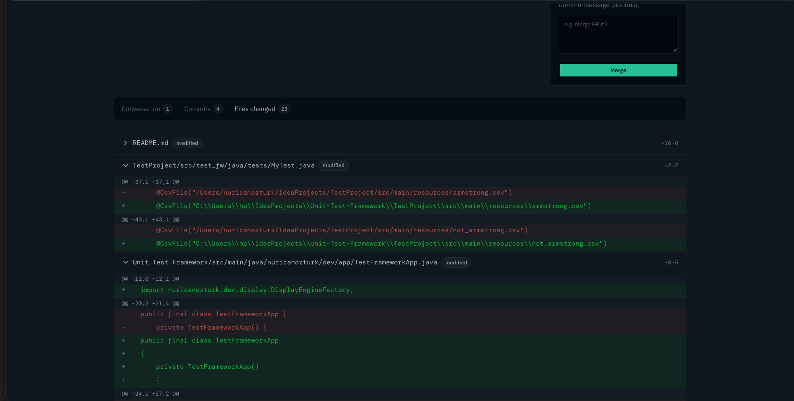</td>
    <td>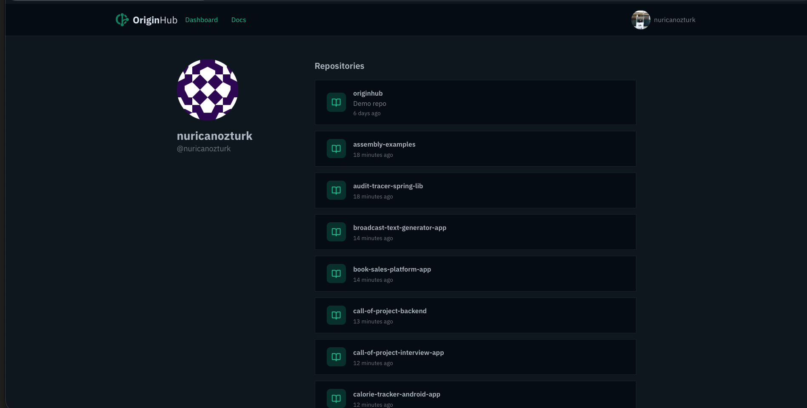</td>
  </tr>
  <tr>
    <td align="center"><b>User Settings</b></td>
    <td align="center"><b>Repo Settings</b></td>
  </tr>
  <tr>
    <td>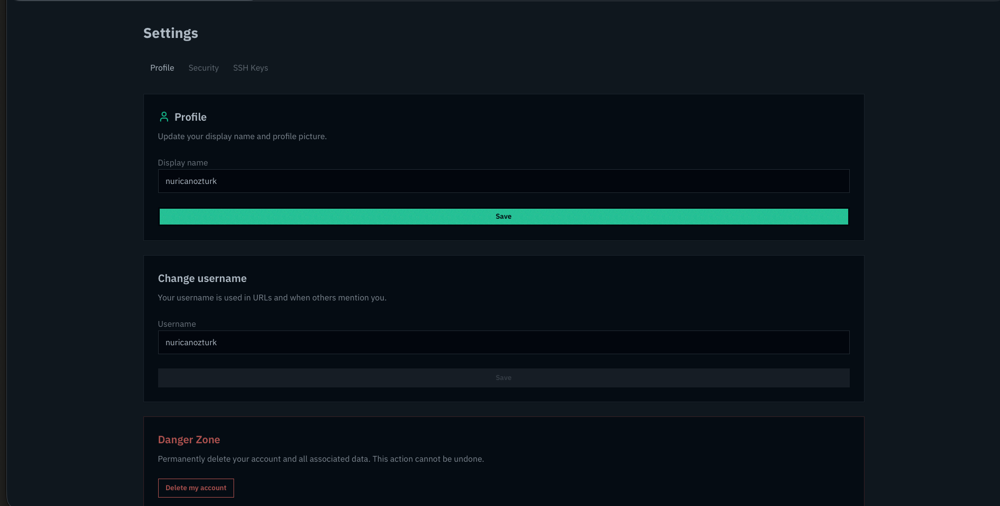</td>
    <td>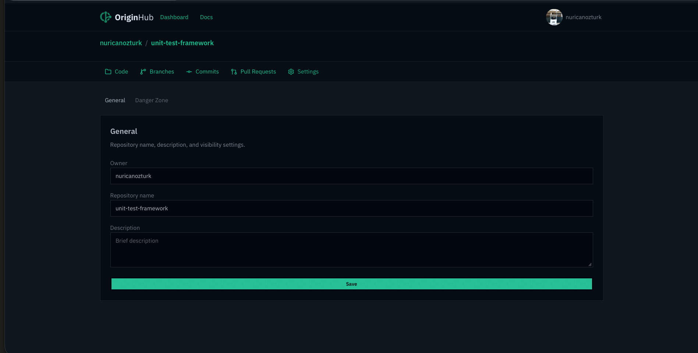</td>
  </tr>
</table>

---

## 🚀 Getting Started

> 📖 Full documentation: **[originhub.nuricanozturk.com/docs](https://originhub.nuricanozturk.com/docs)**

### Option 1 — One-liner *(easiest)*

No clone needed. Just run:

```bash
curl -o docker-compose.yml https://raw.githubusercontent.com/nuricanozturk/originhub/main/docker-compose.yml
docker compose up -d
```

Open [http://localhost:8080](http://localhost:8080) in your browser. Done.

> **Only `ORIGINHUB_JWT_SECRET` is required.** Create a `.env` file next to your `docker-compose.yml`:
>
> ```env
> ORIGINHUB_JWT_SECRET=your_random_256bit_secret_here
> ```

---

### Option 2 — Docker Compose with full config

```bash
git clone https://github.com/nuricanozturk/originhub.git
cd originhub

cp .env.example .env
# Edit .env — set JWT secret, OAuth2 keys, etc.

docker compose up -d
```

---

### Option 3 — Docker Run

If you already have a PostgreSQL instance running:

```bash
docker run -d \
  --name originhub \
  -p 8080:8080 \
  -p 2222:2222 \
  -e SPRING_DATASOURCE_URL=jdbc:postgresql://db:5432/originhub \
  -e SPRING_DATASOURCE_USERNAME=originhub \
  -e SPRING_DATASOURCE_PASSWORD=yourpassword \
  -e ORIGINHUB_JWT_SECRET=your256bithexsecret \
  -e ORIGINHUB_GIT_REPO__ROOT=/data/repos \
  -e SPRING_PROFILES_ACTIVE=prod \
  -v originhub-repos:/data/repos \
  repo.repsy.io/nuricanozturk/originhub:latest
```

---

### Option 4 — Build & Run Manually

```bash
mvn package -DskipTests

java -jar originhub-backend/target/originhub-backend.jar \
  --spring.datasource.url=jdbc:postgresql://localhost:5432/originhub \
  --spring.datasource.username=originhub \
  --spring.datasource.password=yourpassword \
  --originhub.jwt.secret=your256bithexsecret \
  --originhub.git.repo-root=/data/repos
```

---

### Environment Variables

| Variable | Required | Default | Description |
|---|---|---|---|
| `ORIGINHUB_JWT_SECRET` | ✅ | — | Min 32-char secret for JWT signing |
| `DB_USER` | | `admin` | PostgreSQL username |
| `DB_PASSWORD` | | `admin123` | PostgreSQL password |
| `ORIGINHUB_GIT_REPO__ROOT` | | `/data/repos` | Git repository storage path |
| `ORIGINHUB_FRONTEND_BASE_URL` | | `http://localhost:8080` | Public base URL |
| `OAUTH2_GOOGLE_CLIENT_ID` | | — | Google OAuth2 client ID |
| `OAUTH2_GOOGLE_CLIENT_SECRET` | | — | Google OAuth2 client secret |
| `OAUTH2_GITHUB_CLIENT_ID` | | — | GitHub OAuth2 client ID |
| `OAUTH2_GITHUB_CLIENT_SECRET` | | — | GitHub OAuth2 client secret |
| `OAUTH2_GITLAB_CLIENT_ID` | | — | GitLab OAuth2 client ID |
| `OAUTH2_GITLAB_CLIENT_SECRET` | | — | GitLab OAuth2 client secret |

---

## 🗺 Roadmap

OriginHub is under active development. Here's what's planned:

- [ ] HTTPS Git support
- [ ] Public repositories
- [ ] Fork and star repositories
- [ ] Actions — CI/CD (self-hosted runner)
- [ ] Team collaboration & organization support
- [ ] Project board (Kanban) integrated with repositories
- [ ] Webhooks
- [ ] Custom domain support
- [ ] Repository transfer (between accounts, and auto-import from GitHub / GitLab)
- [ ] Code snippets (Gist-like)
- [ ] Two-factor authentication (TOTP)
- [ ] Tags and releases
- [ ] [Repsy](https://repsy.io) package management integration
- [ ] Organization support

---

## 📄 License

OriginHub is open-source software licensed under the [MIT License](LICENSE).

---

## ☕ Support

If OriginHub saves you time or you just want to say thanks, consider buying me a coffee. It keeps the project alive and the commits coming.

<a href="https://www.buymeacoffee.com/nuricanozturk" target="_blank">
  
</a>

---
